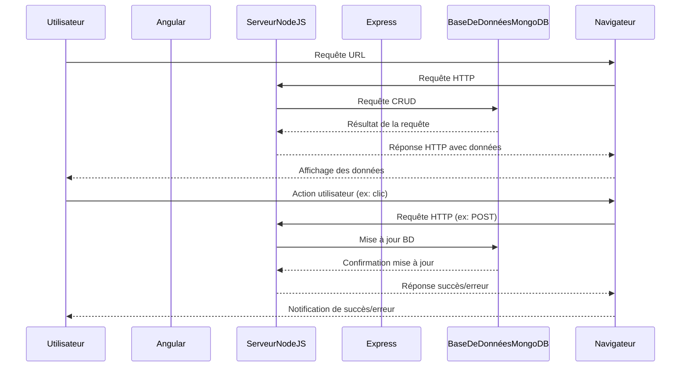

# Diagramme de flow 

```mermaid 
sequenceDiagram
    participant Utilisateur
    participant Angular
    participant ServeurNodeJS
    participant Express
    participant BaseDeDonnéesMongoDB
    
    Utilisateur->>Navigateur: Requête URL
    Navigateur->>ServeurNodeJS: Requête HTTP
    ServeurNodeJS->>BaseDeDonnéesMongoDB: Requête CRUD
    BaseDeDonnéesMongoDB-->>ServeurNodeJS: Résultat de la requête
    ServeurNodeJS-->>Navigateur: Réponse HTTP avec données
    Navigateur-->>Utilisateur: Affichage des données

    Utilisateur->>Navigateur: Action utilisateur (ex: clic)
    Navigateur->>ServeurNodeJS: Requête HTTP (ex: POST)
    ServeurNodeJS->>BaseDeDonnéesMongoDB: Mise à jour BD
    BaseDeDonnéesMongoDB-->>ServeurNodeJS: Confirmation mise à jour
    ServeurNodeJS-->>Navigateur: Réponse succès/erreur
    Navigateur-->>Utilisateur: Notification de succès/erreur
```