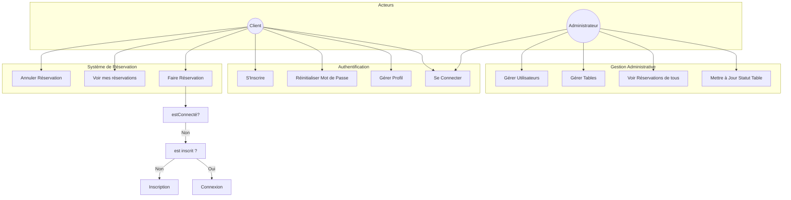

# Diagramme de flows

## Diagrame de séquances entre les technologies

```mermaid
sequenceDiagram
    participant Utilisateur
    participant ApplicationAngular
    participant ServeurNodeJS
    participant ExpressJS
    participant BaseDeDonnéesPostgreSQL

    Utilisateur->>ApplicationAngular: Requête URL (Chargement de l'application)
    ApplicationAngular->>ServeurNodeJS: Requête HTTP (GET)
    ServeurNodeJS->>ExpressJS: Transfert de la requête
    ExpressJS->>BaseDeDonnéesPostgreSQL: Requête SQL (SELECT)
    BaseDeDonnéesPostgreSQL-->>ExpressJS: Résultat de la requête
    ExpressJS-->>ServeurNodeJS: Données formatées
    ServeurNodeJS-->>ApplicationAngular: Réponse HTTP avec données
    ApplicationAngular-->>Utilisateur: Affichage des données

    Utilisateur->>ApplicationAngular: Action utilisateur (sélection)
    ApplicationAngular->>ServeurNodeJS: Requête HTTP (ex: POST/PUT/DELETE)
    ServeurNodeJS->>ExpressJS: Transfert de la requête
    ExpressJS->>BaseDeDonnéesPostgreSQL: Requête SQL (INSERT/UPDATE/DELETE)
    BaseDeDonnéesPostgreSQL-->>ExpressJS: Confirmation mise à jour
    ExpressJS-->>ServeurNodeJS: Résultat de la mise à jour
    ServeurNodeJS-->>ApplicationAngular: Réponse succès/erreur
    ApplicationAngular-->>Utilisateur: Notification de succès/erreur
```

## Diagrame de cas d'utilisations

```mermaid
graph TB
    %% Définition des acteurs
    subgraph Acteurs
        Client((Client))
        Administrateur((Administrateur))
    end

    %% Cas d'utilisation Authentification
    subgraph Authentification
        Inscription[S'Inscrire]
        ReinitMotDePasse[Réinitialiser Mot de Passe]
        GererProfil[Gérer Profil]
        Connexion[Se Connecter]
        
    end

    %% Cas d'utilisation Administrateur
    subgraph Gestion Administrative
        GererUtilisateurs[Gérer Utilisateurs]
        GererTables[Gérer Tables]
        VoirReservations[Voir Réservations de tous]
        MajStatutTable[Mettre à Jour Statut Table]
    end

    %% Cas d'utilisation Client
    subgraph Système de Réservation
        FaireReservation[Faire Réservation]
        AnnulerReservation[Annuler Réservation]
        voirReservationPerso[Voir mes réservations]
    end

    %% Relations
    
    
    Client --> AnnulerReservation
    Client --> voirReservationPerso
    Client --> FaireReservation
    Client --> Inscription
    Client --> ReinitMotDePasse
    Client --> GererProfil
    Client --> Connexion
    
    Administrateur --> Connexion
    Administrateur --> GererUtilisateurs
    Administrateur --> GererTables
    Administrateur --> VoirReservations
    Administrateur --> MajStatutTable

    FaireReservation --> estConnecté?
    estConnecté? -->|Non|a[est inscrit ?]
    a -->|Non|b[Inscription]
    a -->|Oui|c[Connexion]
```
