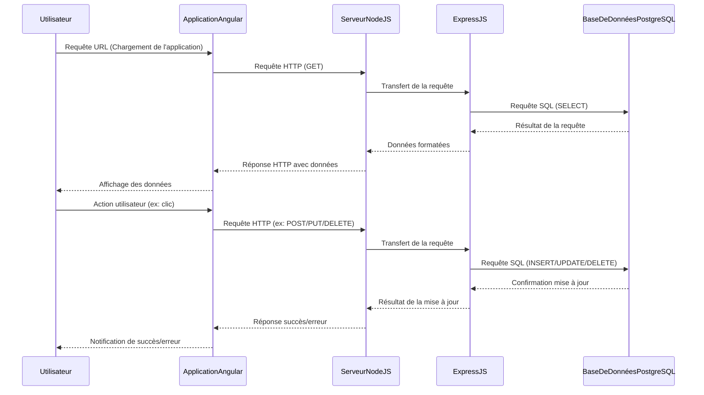

# Diagramme de flow

```mermaid
sequenceDiagram
    participant Utilisateur
    participant ApplicationAngular
    participant ServeurNodeJS
    participant ExpressJS
    participant BaseDeDonnéesPostgreSQL

    Utilisateur->>ApplicationAngular: Requête URL (Chargement de l'application)
    ApplicationAngular->>ServeurNodeJS: Requête HTTP (GET)
    ServeurNodeJS->>ExpressJS: Transfert de la requête
    ExpressJS->>BaseDeDonnéesPostgreSQL: Requête SQL (SELECT)
    BaseDeDonnéesPostgreSQL-->>ExpressJS: Résultat de la requête
    ExpressJS-->>ServeurNodeJS: Données formatées
    ServeurNodeJS-->>ApplicationAngular: Réponse HTTP avec données
    ApplicationAngular-->>Utilisateur: Affichage des données

    Utilisateur->>ApplicationAngular: Action utilisateur (ex: clic)
    ApplicationAngular->>ServeurNodeJS: Requête HTTP (ex: POST/PUT/DELETE)
    ServeurNodeJS->>ExpressJS: Transfert de la requête
    ExpressJS->>BaseDeDonnéesPostgreSQL: Requête SQL (INSERT/UPDATE/DELETE)
    BaseDeDonnéesPostgreSQL-->>ExpressJS: Confirmation mise à jour
    ExpressJS-->>ServeurNodeJS: Résultat de la mise à jour
    ServeurNodeJS-->>ApplicationAngular: Réponse succès/erreur
    ApplicationAngular-->>Utilisateur: Notification de succès/erreur
```
