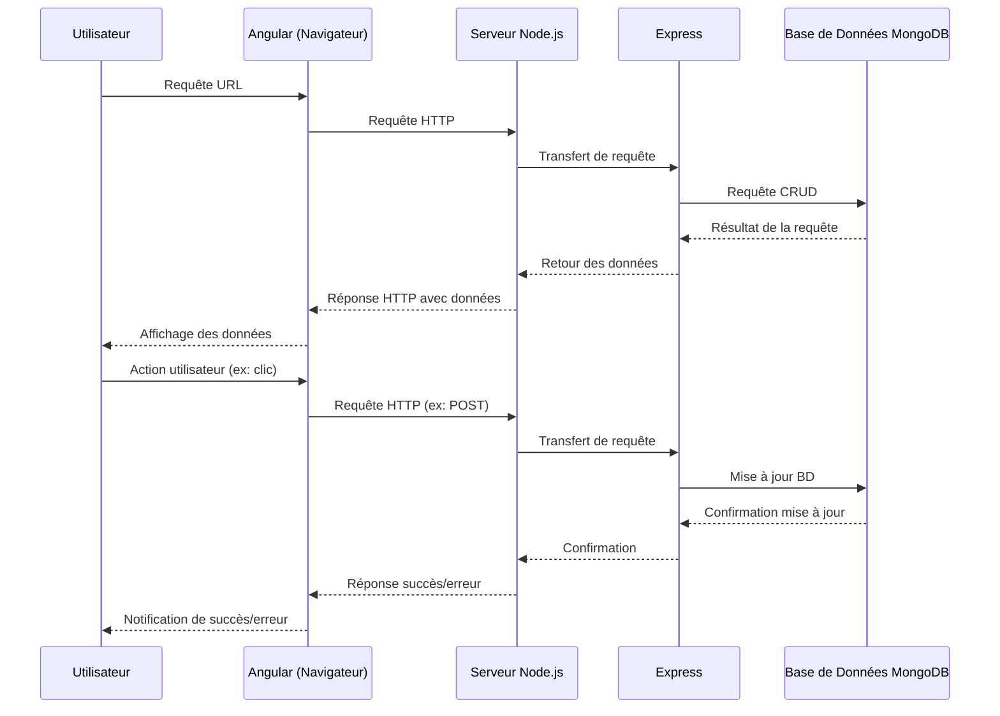

# Diagramme de flow 

```mermaid 
sequenceDiagram
    participant Utilisateur
    participant Navigateur as Angular (Navigateur)
    participant ServeurNodeJS as Serveur Node.js
    participant Express
    participant BaseDeDonnéesMongoDB as Base de Données MongoDB
    
    Utilisateur->>Navigateur: Requête URL
    Navigateur->>ServeurNodeJS: Requête HTTP
    ServeurNodeJS->>Express: Transfert de requête
    Express->>BaseDeDonnéesMongoDB: Requête CRUD
    BaseDeDonnéesMongoDB-->>Express: Résultat de la requête
    Express-->>ServeurNodeJS: Retour des données
    ServeurNodeJS-->>Navigateur: Réponse HTTP avec données
    Navigateur-->>Utilisateur: Affichage des données

    Utilisateur->>Navigateur: Action utilisateur (ex: clic)
    Navigateur->>ServeurNodeJS: Requête HTTP (ex: POST)
    ServeurNodeJS->>Express: Transfert de requête
    Express->>BaseDeDonnéesMongoDB: Mise à jour BD
    BaseDeDonnéesMongoDB-->>Express: Confirmation mise à jour
    Express-->>ServeurNodeJS: Confirmation
    ServeurNodeJS-->>Navigateur: Réponse succès/erreur
    Navigateur-->>Utilisateur: Notification de succès/erreur
```