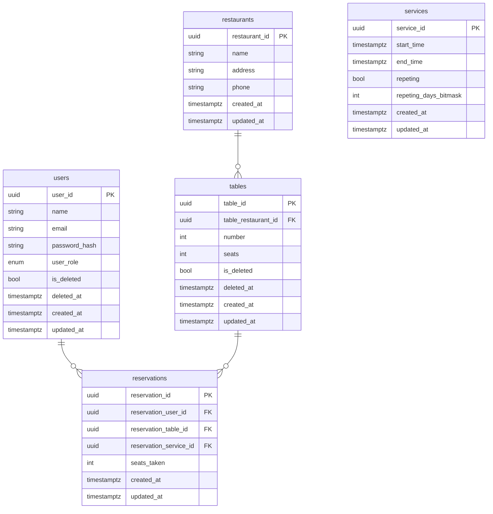

# Diagramme d'entité-relation

```mermaid
erDiagram
    users {
        uuid user_id PK
        string name
        string email
        string password_hash
        enum user_role
        bool is_deleted
        timestamptz deleted_at
        timestamptz created_at
        timestamptz updated_at
    }
    restaurants {
        uuid restaurant_id PK
        string name
        string address
        string phone
        timestamptz created_at
        timestamptz updated_at
    }
    tables {
        uuid table_id PK
        uuid table_restaurant_id FK
        int number
        int seats
        bool is_deleted
        timestamptz deleted_at
        timestamptz created_at
        timestamptz updated_at
    }
    reservations {
        uuid reservation_id PK
        uuid reservation_user_id FK
        uuid reservation_table_id FK
        uuid reservation_service_id FK
        int seats_taken
        timestamptz created_at
        timestamptz updated_at
    }

    services {
        uuid service_id PK
        timestamptz start_time
        timestamptz end_time
        bool repeting
        int repeting_days_bitmask
        timestamptz created_at
        timestamptz updated_at
    }

    users ||--o{ reservations : ""
    restaurants ||--o{ tables : ""
    tables ||--o{ reservations : ""
```
