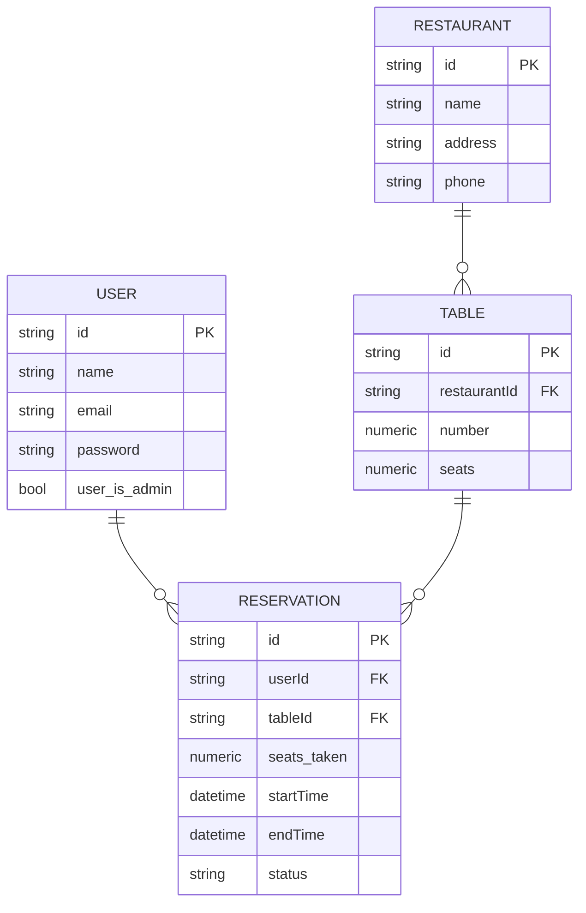

# Diagramme d'entité-relation

```mermaid 
erDiagram
    USER {
        string id PK
        string name
        string email
        string password
		bool user_is_admin
    }

    RESTAURANT {
        string id PK
        string name
        string address
        string phone
    }

    TABLE {
        string id PK
        string restaurantId FK
        numeric number
        numeric seats
    }

    RESERVATION {
        string id PK
        string userId FK
        string tableId FK
        numeric seats_taken
        datetime startTime
        datetime endTime
        string status
    }

    USER ||--o{ RESERVATION : ""
    RESTAURANT ||--o{ TABLE : ""
    TABLE ||--o{ RESERVATION : ""
```