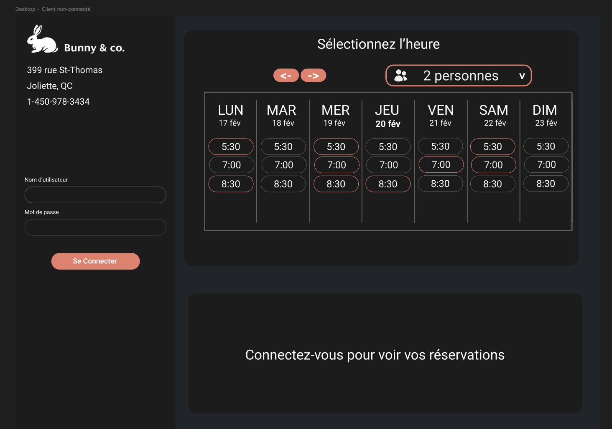

# Prototype d'interfaces

Afin d'avoir une image cohérente de l'application, voici ce que le rendu final devrait ressembler.

Palette :

- primary : #FFFFFF
- secondary : #5F5F5F
- accent : #DC826F
- background : #1C1C1C
- filler : #212529

